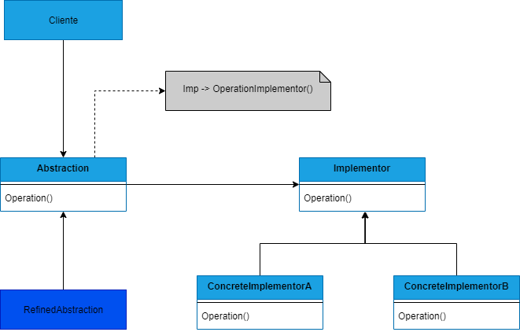

##### tags: 'Padrões estruturais'

## BRIDGE

### Intenção
Desacopla uma abstração de sua implementação, de modo que os dois possam variar independentemente.

### Descrição
O padrão pode ser usado para evitar o vínculo permanente entre uma abstração e sua implementação, por exemplo quando a implementação deve ser alterada em tempo de execução. Tanto as abstrações como as suas implementações tiverem de ser extensíveis por meio de subclasses, nesse caso permite combinar diferentes abstrações e implementações e estendê-las independentemente. Mudanças na implementação de uma abstração não tem impacto sobre clientes. Ou ainda, para compatilhar uma mesma implementação entre vários objetos.

### Benefícios
Entre os benefícios trazidos por este padrão, podemos destacar o desacoplamento de interface da implementação, melhoria na extensibilidade, ocultação de detalhes de implementação dos clientes.

### Frequência de uso nível 3

### Participantes
* **Abstration** - Define a interface de abstração, mantém uma referência para o objeto do tipo implementor;
* **Refined Abstraction** - Estende a interface definida por Abstraction;
* **Implementor** - Define a interface para as classes de implementação;
* **Concrete Implementor** - Implementa a interface de implementor e define sua implementação concreta;

### Diagrama

