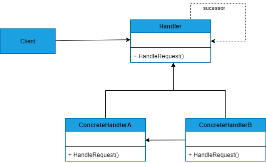

## CHAIN OF RESPONSABILITY
##### tags: `Padrões de projetos` `Padrões comportamentais`

### Intenção
Evitar o acoplamento do remetente de uma solicitação ao seu receptor, ao dar a mais de um objeto a oportunidade de tratar a solicitação. Encadear os objetos receptores, passando a solicitação ao longo da cadeia até que um objeto o trate.

### Descrição
Neste padrão cada objeto receptor possui uma lógica descrevendo os tipos de solicitação que é capaz de processar e como passar adiante aquelas que requeiram processamento por outros receptores. A deleção das solicitações podem formar uma árvore de recursão, com um mecanismo especial para inserção de novos receptores no final da cadeia existente. Dessa forma, fornece um acoplamento mais fraco por evitar a associação explícita do remetente de uma solicitação ao seu receptor e dar a mais de um objeto a oportunidade de tratar a solicitação. Um exemplo da aplicação desse padrão é o mecanismo de herança nas linguagens orientadas a objeto, onde um método chamado em um objeto é buscado na classe que implementa o objeto e, se não encontrado, na superclasse dessa classe, de maneira recursiva.

### Benefícios
O padrão permite determinar quem será o objeto que irá tratar a requisição durante a execução. Cada objeto pode tratar ou passar a mensagem para o próximo na cascata. Dessa forma, o acomplamento é reduzido, dando ainda flexibilidade adicional na atribuição de responsabilidades a objetos.

### Frequência de uso 
Nível 2

### Participantes
* ***Handler*** - Define uma interface para tratar solicitações;
* ***ConcreteHandler*** - Trata de solicitações pelas quais é responsável; pode acessar seu sucessor;
* ***Client*** - Inicia a solicitação para um objeto ConcreteHandler da cadeia;

### Diagrama

