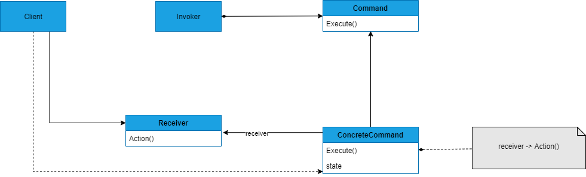

## COMMAND
##### tags: `Padrões de projetos` `Padrões comportamentais`

### Intenção
Encapsular uma requisição como um objeto, desse modo pode-se parametrizar clientes com diferentes requisições, com suporte para enfileirar, logar e desfazer essas requisições.

### Descrição
A chave deste padrão é uma classe abstrata Command, a qual declara uma interface para execução de operações. Na sua forma mais simples, esta interface inclui uma operação abstrata execute. As subclasses concretas de Command especificam uma para receptor ação através do armazenamento do receprtor como uma variável de instância e pela implementação de execute para invocar a solicitação. O receptor tem o conhecimento necessário para poder executar a solicitação.

### Benefícios
Desacopla o objeto que invoca a operação daquele que sabe como executá-lo; é fácil criar novos comandos porque não é necessário mudar classes existentes.

### Frequência de uso 
Nível 4

### Participantes
* ***Command*** - Declara uma interface para executar a operação;
* ***ConcreteCommand*** - Define uma vinculação entre o objeto *Receiver* e uma ação; Implementa Execute invocando a operação correspondente em Receiver;
* ***Client*** - Cria um objeto *ConcreteCommand* e configura o seu receptor;
* ***Invoker*** - Solicita ao *Command* a execução da solicitação;
* ***Receiver*** - Sabe como executar as operações associadas a uma solicitação; qualquer classe pode funcionar como um receiver;

### Diagrama

