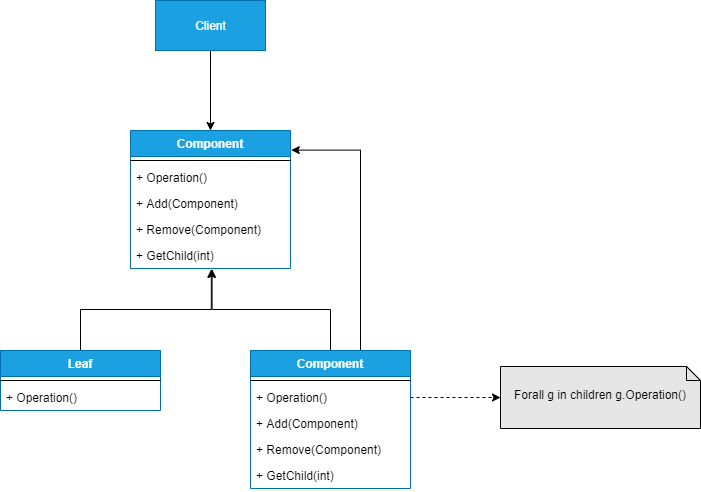

## COMPOSITE
##### tags: `Padrões de projetos` `Padrões estruturais`

### Intenção
Compor objetos em estruturas de árvore para representar hierarquias parte ou todo. *Composite* permite que clientes tratem objetos individuais e composições de objetos de maneira uniforme.

### Descrição
Por exemplo, em interfaces gráficas um elemento gráfico pode ser constituído pela composição de fários outros elementos gráficos. Uma janela pode conter um ou mais ícones, uma caixa de texto e vários outros elementos gráficos, até mesmo outra janela. Considerando que uma determinada hierarquia de classes *Control* como a *supoer-classe* comum a todas as classes que *Form* seria representada como uma classe que contém zero (0) ou mais elementos gráficos.

É importante observar que será responsabilidade do objeto composto, para cada método a ser aplicável à lista de objetos que possi, implementá-lo de maneira repetitiva. Por exemplo, no caso da hierarquia de elementos gráficos exemplificada, suponha que um objeto cliente ative o método *Draw* de um objeto do tipo *Form*. Exte método deverá ser capaz de ativar os métodos *Draw* de cada um dos objetos que ele contém. Desta maneira será possível interagir com uma composição de objetos da mesma forma que se interage com objetos individuais.

### Benefícios
Entre os benefícios trazidos pelo uso do padrão podemos citar a definição de hierarquia de classes que consistem de objetos primitivos e objetos compostos, podendo assim compor objetos mais complexos. Sempre que o código do cliente esperar um objeto primitivo, poderá também aceitar um composto. Além disso, o padrão torna o cliente simples, pois pode tratar estruturas diferentes de maneira uniforme (não importa se é um tipo folha ou composto). Torna também mais fácil a adição de novas espécies de componentes.

### Frequência de uso 
Nível 4

### Participantes
* ***Component*** - declara a interface para os objetos na composição; implementa comportamento padrão para interface comum; declara interface para gerenciar filhos; 
* ***Leaf*** - representa objetos ***"folhas"*** na composição;
* ***Composite*** - define comportamentos para os componentes que têm filhos; implementa operações relacionadas com os filhos;
* ***Client*** - manipula objetos na composição através da interface de ***Component***;

### Diagrama

