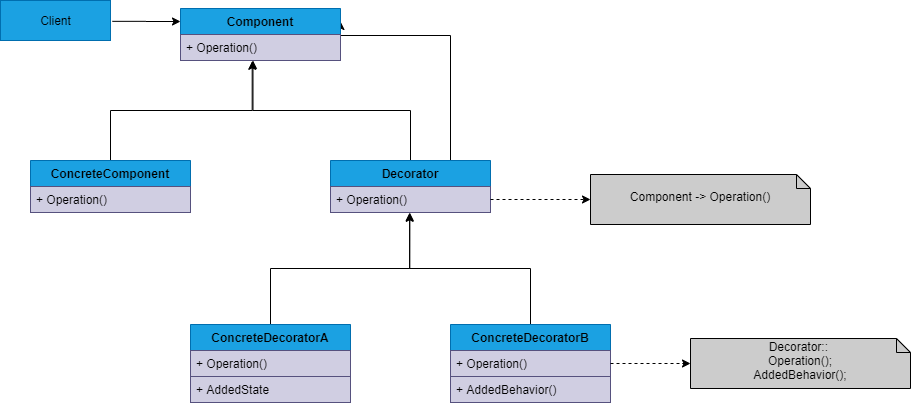

## DECORATOR
##### tags: `Padrões de projetos` `Padrões estruturais`

### Intenção
Anexar responsabilidades adicionais a um objeto dinamicamente. Fornece uma alternativa flexível na criação de subclasses para estender funcionalidades.

### Descrição
O padrão, e conhecido também  como wrapper, favorece o uso de composição sobre a herança. Permite adicionar (ou remover) responsabilidades individuais a uma classe de forma dinâmica, flexível e transparente. Ao usuar herança, uma classe formalmente especifica seu tipo herdado e gera uma relação de dependência praticamente imutável, gerando fortes acoplamentos. O padrão Decorator, ao invés disso, permite estender uma classe "decorando-a" com novas funcionalidades, sem que seja necessário criar uma grande hierarquiva de subclasses.

### Benefícios
Os benefícios do uso do padrão são inúmeros, como principal e já citado a flexibilidade, pois não faz uso de herança, que é estática. Além disso, evita criar uma classe com inúmeras responsabilidades expostas em suas interface, já que a "decoração" é interna. Funções são delegadas internamente sem exposição publica.

### Frequência de uso 
Nível 3

### Participantes
* ***Componente*** - Define a interface para objetos que podem ter responsabilidades acrescentadas dinamicamente;
* ***ConcreteComponent*** - Define um objeto para o qual as responsabilidades adicionais podem ser atribuídas;
* ***Decorator*** - Mantém uma referência para um objeto **Component** e define uma interface que segue a interface de **Component**;
* **ConcreteDecorator** - Acrescenta responsabilidades ao componente.
### Diagrama

