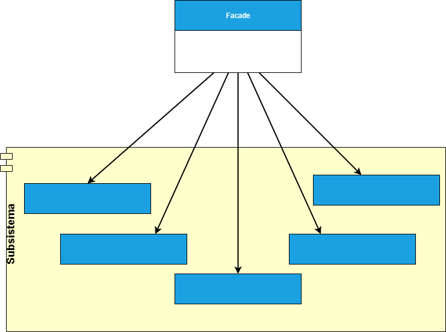

## FAÇADE
##### tags: `Padrões de projetos` `Padrões estruturais`

### Intenção
Fornecer uma interface unificada para um conjunto de interfaces em um subsistema. Facade define uma interface de nível mais elevado que faz o subsistema mais fácil de usar.

### Descrição
Uma boa aplicação para o *Façade* "fachada" é criar uma forma mais simples para os objetos clientes de lidarem com um sistema mais complexo, escondendo muito de sua implementação fortalecendo o encapsulamento e isolamento.

### Benefícios
Torna uma biblioteca de software mais fácil de entender e usar; tornar o código que utiliza esta biblioteca mais fácil de entender; reduzir as dependências em relação às características internas de uma biblioteca, trazendo flexibilidade no desenvolvimento do sistema; envolver uma interface mal desenhada, com uma interface melhor definda.

### Frequência de uso 
Nível 5

### Participantes
* ***Façade*** - Conhece quais as classes do subsistema que são responsáveis pelo atendimento de uma solicitação; delega solicitações de clientes a objetos apropriados do subsistema;
* ***Classes de subsistema*** - Implementam as funcionalidades do subsistema; encarregam-se do trabalho atribuído a elas pelo objeto *Façade*; não tem conhecimento "referência" ao *Façade*;

### Diagrama

### Exemplo
