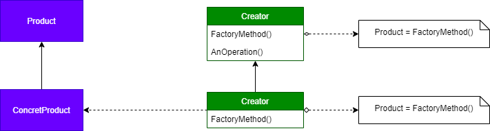

# Padrão de projeto FACTORY METHOD

## Intenção

Definir uma inteface para criar um objeto, mas deixa as subclasses decidir qual classe instanciar. Permite uma classe adiar a instanciação para subclasses.

## Descrição

O padrão pode ser aplicado quando uma classe não é capaz de saber antecipadamente quais objetos devem realmente ser cirados, ou ainda, quando uma classe repassa (delega) para suas subclasses e responsabilidade de quais objetos realmente devem ser criados.

## Benefícios

O uso do padrão traz vários benefícios, sendo o maio deles a flexibilidade. como a criação de um objeto é encapsulada por um método de fábrica, classes clientes não criam esses objetos diretamente. Além disso, como uma classe cliente usa o método de fábrica para obter uma instância de uma classe desejada, o padrão pode ser usado como uma forma transparente e flexível para fornecer um objeto diferente. Isso porque é possível retornar uma subclasse compatível com a classe do objeto retornado pelo método. Também é útil para conectar hierarquias de classes paralelas, quando uma classe precisa delegar determinada responsabilidade para outra classe. Nesse caso, o padrão facilita essa interação. 

### Frequência de uso nível 5

## Participantes
<ul>
    <li>Product – define a interface do objeto que o método de fábrica cria;</li>
    <li>Concrete Product – Implementa a interface Product; </li>
    <li>Creator – Declara o método de fábrica, o qual retorna um objeto do tipo Product. Creator também pode definir uma implementação por omissão do método factory que retorna por omissão um objeto Concrete Product; </li>
    <li>Concrete Creator – redefine o método fábrica para retornar uma instância de um Concrete Product</li>
</ul>

