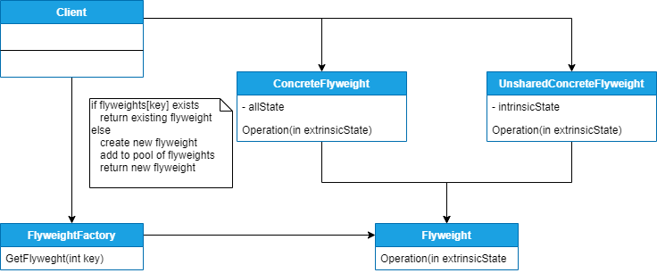

## FLYWEIGHT
##### tags: `Padrões de projetos` `Padrões estruturais`

### Intenção
Usar compartilhamento para suportar um grande número de objetos semelhantes de forma eficiente.

### Descrição
O objetivo do padrão Flyweight é minimizar o uso de memória no armazenamento de vários objetos através do compartilhamento de informações em comum que essas instâncias possuem. É essa a ideia da aplicação do padrão, fazer com que tenhamos aplicações leves. Quando trabalhamos com orientação a objetos, utilizamos classes para representar cada parte das aplicações. Por exemplo, um sistema de vendas terá objetos que representam boletos, notas fiscais, item da nota etc. um editor de texto provavelmente téra objetos que representam parágrafos, frases, caracteres, imagens etc. Com essa abordagem temos vantagens da programação orientada a objetos, como herança, polimorfismo e encapsulamento, no entanto podemos introduzir um gasto na manutenção de todas essas estruturas de objetos. É esse problema que o Flyweight atua.

O conceito principal para a utilização deste padrão é a distinção entre dados intrínsecos e dados extrínsecos. Dados intrínsecos são as informações comuns entre as várias instâncias e que por essa característica podem ser compartilhadas já os dados extrínsecos são as informações específicas de cada objeto e que consequentemente não podem ser compartilhadas. Os dados intrínsecos são mantidos nos objetos que implementam a Flyweight, e os extrínsecos são mantidos pelo cliente. Este padrão é especialmente indicado para os casos de aplicações com um grande número de objetos com muitas informações que devem ser armazenados em memória, do outro lado, ele não deve ser utilizado em situações em que precisamos fazer comparações entre os objetos, já que como eles serão compartilhados, esse tipo de ação se torna inviável "as comparações sempre retornarão que os objetos são os mesmos!".

### Benefícios
Redução do número total de instâncias obtidas com o compartilhamento.

### Frequência de uso 
Nível 1

### Participantes
* ***Flyweight*** – é a interface que define como devem ser as classes que trabalham neste padrão.
É importante citar que ela descreve como os dados extrínsecos são recebidos, ou seja, as
operações que fazem essa transposição de informações;
* ***ConcreteFlyweight*** – são as classes que implementam o contrato IFlyweight e que devem
permitir o compartilhamento. Essas classes mantêm dados intrínsecos;
* ***UnsharedConcreteFlyweight*** – possuem as mesmas características do ConcreteFlyweight, no
entanto não são objetos compartilhados. Isso porque esse padrão permite o
compartilhamento, mas não obriga que isso seja sempre seguido;
* ***FlyweightFactory*** – classe que é responsável pela criação dos objetos, além de manter o
repositório de objetos que implementam o Flyweight;
* ***Client*** – é quem utiliza os objetos IFlyweight, sempre os obtendo através do FlyweightFactory.
### Diagrama

### Exemplo
