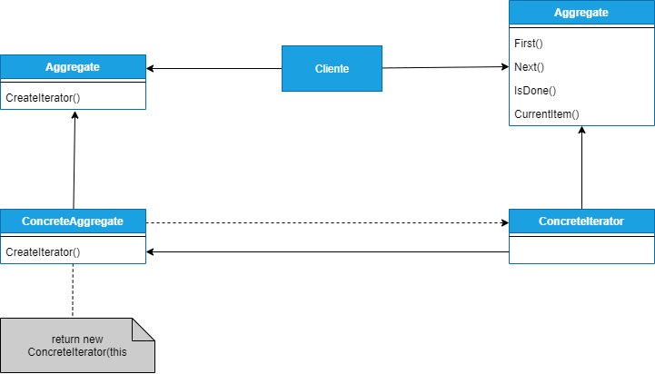

## INTERATOR
##### tags: `Padrões de projetos` `Padrões comportamentais`

### Intenção
Fornece uma maneira de acessar os elementos de um objeto agregado sequencialmente sem expor sua representação.

### Descrição
Um objeto agregado, com uma lista por exemplo, deveria sempre oferecer uma forma de acessar seus elementos (dados) sem expor sua estrutura interna. Além disso, essa lista poderia ser examinada de diferentes formas, dependendo do que precisa ser realizado (procurar, ordenar etc.) normalmente uma interface para cada operação sobrecarregaria a classe. Nesse caso um padrão uniforme (o Interator) provê uma estratégia conhecida atualmente como "programação genérica", que visa separar explicitamente algoritmos de estruturas de dados.

### Benefícios
Os principais benefícios do padrão é promover a programação baseada em componentes, reutilização e aumento de produtividade.

### Frequência de uso 
Nível 5

### Participantes
* ***Interator*** - Define uma interface para acessar e percorrer elementos;
* ***ConcreteInterator*** - Implementa a interface do Iterator; mantém o controle da posição correte no percurso do agregado;
* ***Aggregate*** - Define uma interface para a criação de um objeto interator;
* ***ConcreteAggregate*** - Implementa a interface de criação do interator para retornar uma instância do ConcreteCreator apropriado;

### Diagrama


### Exemplo
```csharp=
using System;
using System.Collections.Generic;

namespace Interator
{
    class Program
    {
        static void Main(string[] args)
        {
            // Cria Concrete Aggregate
            Equipe equipe = new Equipe();
            equipe[0] = "Stanley";
            equipe[1] = "Dias";
            equipe[2] = "Paulo";
            equipe[3] = "Marinho";
            equipe[4] = "Jose";
            // Cria Iterator
            ConcreteIterator i = new ConcreteIterator(equipe);
            // iterar pela coleção
            Console.WriteLine("Listando membros da equipe:");
            Object item = i.First();
            while (item != null)
            {
                Console.WriteLine(item);
                item = i.Next();
            }
        }
    }

    // Iterator
    public abstract class Iterator
    {
        public abstract Object First();
        public abstract Object Next();
        public abstract bool IsDone();
        public abstract Object CurrentItem();
    }
    // Aggregate
    public abstract class Aggregate
    {
        public abstract Iterator CreateIterator();
    }

    // Concrete Aggregate
    public class Equipe : Aggregate
    {
        private List<string> _items = new List<string>();
        public override Iterator CreateIterator()
        {
            return new ConcreteIterator(this);
        }
        public int Count
        {
            get { return _items.Count; }
        }
        // indexer
        public Object this[int index]
        {
            get { return _items[index]; }
            set { _items.Insert(index, (string)value); }
        }
    }

    public class ConcreteIterator : Iterator
    {
        private Equipe _aggregate;
        private int current = 0;
        public ConcreteIterator(Equipe aggregate)
        {
            _aggregate = aggregate;
        }
        public override object First()
        {
            return _aggregate[0];
        }
        public override object Next()
        {
            Object ret = null;
            if (current < _aggregate.Count - 1)
                ret = _aggregate[++current];
            return ret;
        }
        public override bool IsDone()
        {
            return current >= _aggregate.Count ? true : false;
        }
        public override object CurrentItem()
        {
            return _aggregate[current];
        }
    }
}
```