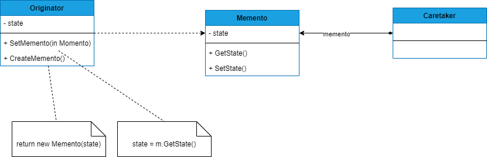

## MEMENTO
##### tags: `Padrões de projetos` `Padrões comportamentais`

### Intenção
Sem violar o encapsulamento, captura e externaliza o estado interno de um objeto para que o objeto possa ser restaurado para este estado mais tarde.

### Descrição
O padrão pode ser aplicado quando, o estado de um objeto deve ser salvo de maneira que possa ser restaudado para este mesmo estado mais tarde; quando uma interface de estado exporia detalhes de implementação e romperia o encapsulamento do objeto; 

### Benefícios
Prevensão das fronteiras de encapsulamento; definição de interfaces mínimas e amplas;

### Frequência de uso 
Nível 1

### Participantes
* Memento - Armazena o estado interno do objeto Originador. O Memento pode armazenar um pouco ou muito do estado do Originador, conforme necessário; Protege contra acessos por objetos que não o Originador;
* Originator - Cria um Memento contendo um instantâneo do seu estado interno corrente; usa o Memento para restaurar o seu estado interno;
* Caretaker - É responsável pela custódia do Memento; nunca opera ou examina os conteúdos de um Memento; 

### Diagrama


### Exemplo

```csharp
    class Program
    {
        static void Main(string[] args)
        {
            // cria orignator
            Pessoa p = new Pessoa();
            p.State = "Stanley";
            // Mostra o estado original
            Console.WriteLine($"Estado original: {p.State}");
            Caretaker c = new Caretaker();
            c.Memento = p.CreateMemento();
            // trocando o estado...
            p.State = "Stanley Dias";
            // mostra estado atual
            Console.WriteLine($"Estado atual: {p.State}");
            // restaurar o estado original
            p.SetMemento(c.Memento);
            // mostra estado atual
            Console.WriteLine($"Estado restaurado: {p.State}");
        }
    }

    public class Memento
    {
        public string State { get; private set; }       
        public Memento(string state)
        {
            State = state;
        }
    }

    public class Pessoa
    {
        public string State { get; set; }
        public Memento CreateMemento(){
            return new Memento(State);
        }
        
        public void SetMemento(Memento memento){
            Console.WriteLine("Restaurando o estado...");
            State = memento.State;
        }
    }

    public class Caretaker
    {
        public Memento Memento { get; set; }        
        
    }
```