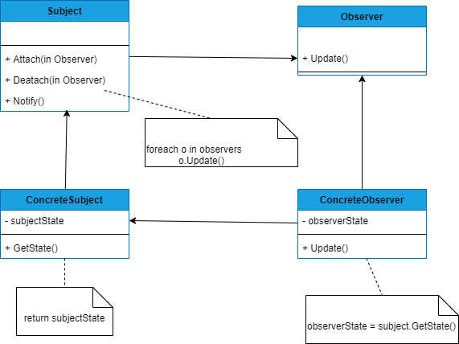

## OBSERVER
##### tags: `Padrões de projetos` `Padrões comportamentais`

### Intenção
Define uma dependência um-para-muitos entre objetos de modo que quando um objeto muda de estado, todos os seus dependentes são notificados e atualizados automaticamente.

### Descrição
O padrão pode ser aplicado, quando uma abstração tem dois aspectos, um dependente de outro. Encapsulando esses aspectos em objetos separados, permite-se variá-los e reutilizá-los independentemente; quando uma mudança em um objeto exige mudanças em outros, e você não sabe quantos necessitam ser mudados; quando um objeto deveria ser capaz de notificar outros objetos sem fazer hipóteses, ou usar informações, sobre quem são esses objetos. Em outras palavras, você não quer que esses objetos sejam fortemente acoplados;

### Benefícios
Acoplamento abstrato entre Subject e Observer; suporte para comunicação do tipo "broadcast".

### Frequência de uso 
Nível 5

### Participantes
* **Subject** - Conhece os seus observadores. Um número qualquer de objetos Observer pode observar um Subject;
* **Observer** - Define uma interface de atualização para objetos que deveriam ser notificados sobre mudanças em um Subject;
* **Concrete Subject** - Armazena estados de interesse para objetos ConcreteObserver; envia uma notificação para os seus observadores quando seu estado muda;
* **ConcreteObserver** - Mantém uma referência para um objeto consistentes com os do Subject; implementa a interface de atualização de Observer, para manter seus estados consistentes com o do Subject;

### Diagrama


### Exemplo
```csharp
    class Program
    {
        static void Main(string[] args)
        {
            // concrete subject
            Balanco balanco = new Balanco();
            // Concrete observer
            Venda venda = new Venda(balanco);
            balanco.Attach(venda);
            // add os observadores
            balanco.Iniciar();
            //balanco.Finalizar();
            // pode vender?
            venda.Iniciar();
        }
    }

    public abstract class Observer 
    {
        public abstract void Update();
    }

    public abstract class Subject
    {
        private List<Observer> _observadores = new List<Observer>();

        public void Attach(Observer observer)  
        {
            // add um observador na lista
            _observadores.Add(observer);
        }
        public void Notify()
        {
            foreach (var o in _observadores)
            {
                o.Update();
            }
        }
    }

    public class Balanco: Subject
    {
        public bool State {get;set;}

        public void Iniciar()
        {
            State = true;
            Console.WriteLine("Balanço iniciado...");
            // notifica os observadores
            Notify();
        }

        public void Finalizar()
        {
            State = false;
            Console.WriteLine("Balanço finalizado...");
            // notifica os observadores
            Notify();
        }
    }    

    public class Venda : Observer
    {
        private bool _state = false;
        private Balanco _balanco;
        public Venda(Balanco balanco)
        {
            this._balanco = balanco;
        }

        public void Iniciar(){
            if(!_state)
                Console.WriteLine("Venda iniciada...");
            else
                Console.WriteLine("Não posso iniciar venda pois balanço está em andamento");
        }

        public override void Update()
        {
            _state = _balanco.State;
        }
    }
```