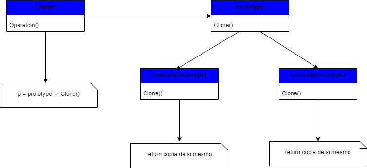

## Padrão de projeto Prototype

### Intenção
Especificar os tipos de objetos para criar usando um protótipo de instância e então criar novos objetos copiando este protótipo.

### Descrição
Protótype pode ser usado quando um sistema tiver que ser independente de como os seus produtos são criados, compostos e representados; ou ainda, quando as classes a instanciar forem especificadas em tempo de execução, por exemplo, por carga dinâmica; ou para evitar a construção de uma hierarquia de classes de fábrica paralela à hierarquia de classes de produto; ou quando as instâncias de uma classe puderem ter um dentre poucas combinações diferentes de estados. Podem ser mais convenientes instalar um número correspondente de protótipos e cloná-los, ao invés de instanciar a classe manualmente, cada vez com um estado apropriado. 

### Benefícios
Dentre os benefícios trazidos pelo padrão, muitos são semelhantes ao trazidos por Abstract Factory e Builder: oculta as classes de produtos concreta do cliente. Algumas adicionais são a possibilidade de adicionar e remover produtos em tempo de execução, especificar novos objetos pela variação de valores (usando composição), especificar novos objetos pela variação da estrutura, reduz o número de subclasses, e configura dinamicamente uma aplicação com classes. 

### Frequência de uso nível 3

### Participantes
* `Prototype` – Declara uma interface para clonar a si próprio; 
* `Concrete Product` – Implementa uma operação para clonar a si próprio; 
* `Cliente` – Cria um novo objeto solicitando a um protótipo que clone a si próprio; 

