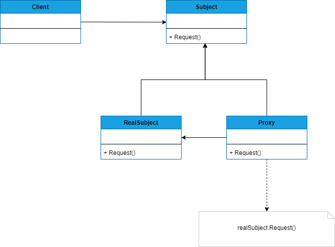

## PROXY
##### tags: `Padrões de projetos` `Padrões estruturais`

### Intenção
Fornecer um substituo ou espaço reservado para outro objeto controlar o acesso a ele.

### Descrição
Um proxy, de forma geral, é uma classe que funciona com uma interface para outra classe. A classe proxy poderia conectar-se a qualquer coisa, uma conexão de rede, um objeto grande em memória, um arquivo, ou a um recurso que é difícil ou impossível de ser duplicado.

### Benefícios
Podemos dizer que um proxy pode ocultar o fato de que um objeto reside em um espaço de memória diferente, um proxy virtual pode executar otimizações, tais como criação de objetos sob demanda. 

### Frequência de uso 
Nível 4

### Participantes
* ***Proxy*** - Mantém uma referência que permite ao *proxy* acessar o objeto real, fornece uma interface idêntica ao *Subject*, por esse motivo ele pode substituir o objeto real ***RealSubject***, controla o acesso ao objeto real, podendo ser responsável pela criação de destruição;
* ***Subject*** - Define uma interface comum para *RealSuject* e *Proxy*;
* ***RealSubject*** - Define o objeto real que o *proxy* representa;

### Diagrama

### Exemplo
