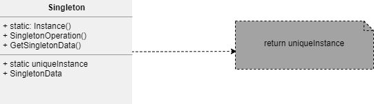

## Padrão de projeto Singleton

### Inteção
Garante que uma classe tem apenas uma instância, e fornece um ponto global de acesso a ela.

### Descrição
O padrão `Singleton` pode ser usado quando for preciso haver apenas uma instância de uma classe e essa instância tiver que dar acesso aos clientes através de um ponto bem conhecido. Ou quando a única instância tiver de ser extensível através de subclasses, possibilitando aos clientes usar uma instância estendida sem alterar o seu código. 

### Benefícios
Entre alguns benefícios do uso do padrão, podemos citar o acesso controlado à instância única; pode-se criar subclasses do `singleton` sem impacto nas classes clientes; permite ainda o controle do número de instâncias internamente. 

### Frequência de uso nível 4

### Participantes
* `Singleton` - define uma operação `instance` que permite aos clientes acessarem sua única instância. `instance` é uma operação de classe (método estático); pode ser responsável pela criação de sua própria instância única.

