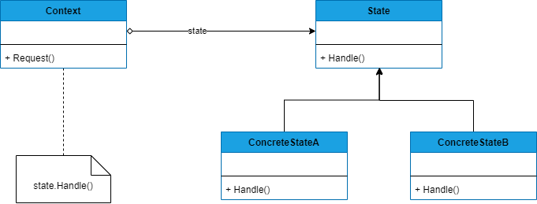

## STATE
##### tags: `Padrões de projetos` `Padrões comportamentais`

### Intenção
Permite que um objeto altere seu comportamento quando seu estado interno muda.

### Descrição
O padrão pode ser aplicado, quando o comportamento de um objeto depende do seu estado e ele pode mudar seu comportamento em tempo de execução, dependendo desse estado; operações têm comandos condicionais grandes, de várias alternativas, que dependem do estado do objeto. Esse estado é normalmente representado por uma ou mais constantes enumeradas. Frequentemente, várias operações conterão essa mesma estrutura condicional. O padrão State coloca cada ramo do comando adicional em uma classe separada. Isto lhe permite tratar o estado do objeto como um objeto propriamente dito, que pode variar independentemente de outros objetos.

### Benefícios
O padrão confina comportamentos específicos de estados e particiona o comportamento para etados diferentes; ele torna explícitas as transações de estado; objetos state podem ser compartilhado. 

### Frequência de uso 
Nível 3

### Participantes
* Context - Define a interface de interesse para os clientes; mantém uma instância de uma subclasse ConcreteState que define o estado corrente;
* State - Define uma interface para o encapsulamento associado com um determinado estado do Context;
* ConcreteState Subclasses - Cada subclasse implementa um comportamento associado com um estado do Context;
### Diagrama


### Exemplo
```csharp
    class Program
    {
        static void Main(string[] args)
        {
            Connection con = new Connection(new ConnectionOpened());
            con.Open();
            con.Close();            
        }
    }

    public abstract class ConnectionState
    {
        public abstract void Open(Connection context);
        public abstract void Close(Connection context);
    }

    public class Connection
    {
        private ConnectionState _state;
        public Connection(ConnectionState state)
        {
            _state = state;
        }

        public ConnectionState State{
            get {
                return _state;
            }
            set {
                _state = value;
                Console.WriteLine($"State: {_state.GetType().Name }");
            }
        }

        public void Open(){
            _state.Open(this);
        }

        public void Close(){
            _state.Close(this);
        }
        
    }

    public class ConnectionClosed: ConnectionState
    {
        public override void Open(Connection context)
        {
            context.State = new ConnectionOpened();
        }

        public override void Close(Connection context)
        {
            context.State = new ConnectionClosed();
        }
    }
    public class ConnectionOpened: ConnectionState
    {
        public override void Open(Connection context)
        {
            context.State = new ConnectionOpened();
        }

        public override void Close(Connection context)
        {
            context.State = new ConnectionClosed();
        }
    }
```
