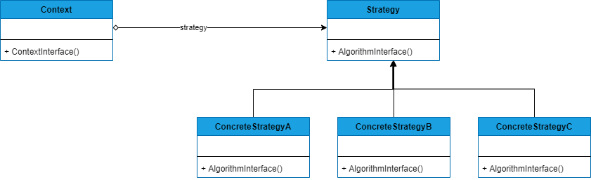

## STRATEGY
##### tags: `Padrões de projetos` `Padrões comportamentais`

### Intenção
Definir uma família de algoritmos, encapsular cada um, e torná-los intercambiáveis. Permite que o algoritmo varie independentemente dos clientes que utilizam. 

### Descrição
Esse padrão pode ser aplicado quando muitas classes têm propósitos semelhantes e divergem apenas no seu comportamento (implementação). Ou ainda, quando é necessário encapsular a solução para um problema resolvido por um ou mais algoritmos, dos quais classes clientes não deve tomar conhecimento.

### Benefícios
Este padrão traz alguns benefícios, como por exemplo, a eliminação de comandos condicionais para a seleção de um comportamento desejado (algoritmo) para resolver um problema. Ao usar herança, *Strategy* encapsula esses comportamentos em subclasses e usa polimorfismo (que é dinâmico) para substituir as condicionais estáticas, abrindo inclusive a arquitetura para fácil inclusão de novas estratégias para solucionar o mesmo problema.

### Frequência de uso 
Nível 4

### Participantes
* **Strategy** - Define uma interface comum para todos os algoritmos suportados. Context usa esta interface para chamar o algoritmo definido por uma ConcreteStrategy;
* **ConcreteStrategy** - Implementa o algoritmo usando a interface Strategy;
* **Context** - Mantém uma referência para o objeto *Strategy*; pode definir uma interface que permite a *Strategy* acessar seus dados;


### Diagrama


### Exemplo
```csharp
    class Program
    {
        static void Main(string[] args)
        {
            long[] inputArray = new long[20];
            Random rnd = new Random();

            for (var i = 0; i < inputArray.Length; i++)
            {
                inputArray[i] = rnd.Next(100);
            }
            Console.WriteLine("Números originais:");
            foreach (var item in inputArray)
                Console.WriteLine(item);

            Context ctx = new Context(new InsertionSort());
            ctx.ContextInterface(inputArray);

            Console.WriteLine("Números ordenados:");
            foreach (var item in inputArray)
                Console.WriteLine(item);

        }
    }

    public abstract class BaseSort
    {
        public abstract void Sort(long[] inputArray);
        protected void Swap(ref long valOne, ref long ValTwo)
        {
            valOne = valOne + ValTwo;
            ValTwo = valOne - ValTwo;
            valOne = valOne - ValTwo;
        }
    }

    public class Context
    {
        BaseSort _strategy;
        public Context(BaseSort strategy)
        {
            this._strategy = strategy;
        }

        public void ContextInterface(long[] inputArray)
        {
            _strategy.Sort(inputArray);
        }
    }

    public class BubbleSort : BaseSort
    {
        public override void Sort(long[] inputArray)
        {
            for (int iterator = 0; iterator < inputArray.Length; iterator++)
            {
                for (int index = 0; index < inputArray.Length - 1; index++)
                {
                    if (inputArray[index] > inputArray[index + 1])
                    {
                        Swap(ref inputArray[index], ref inputArray[index + 1]);
                    }
                }
            }
        }

        private void SwapWithTemp(ref long valOne, ref long valTwo)
        {
            long temp = valOne;
            valOne = valTwo;
            valTwo = temp;
        }
    }
    public class SelectionSort : BaseSort
    {
        public override void Sort(long[] inputArray)
        {
            long index_of_min = 0;
            for (int iterator = 0; iterator < inputArray.Length - 1; iterator++)
            {
                index_of_min = iterator;
                for (int index = iterator + 1; index < inputArray.Length; index++)
                {
                    if (inputArray[index] < inputArray[index_of_min])
                        index_of_min = index;
                }
                Swap(ref inputArray[iterator], ref inputArray[index_of_min]);
            }
        }
        private void Swap(ref long valOne, ref long valTwo)
        {
            valOne = valOne + valTwo;
            valTwo = valOne - valTwo;
            valOne = valOne - valTwo;
        }
    }

    public class InsertionSort : BaseSort
    {
        public override void Sort(long[] inputArray)
        {
            long j;
            long temp = 0;
            for (int index = 1; index < inputArray.Length; index++)
            {
                j = index;
                temp = inputArray[index];
                while ((j > 0) && (inputArray[j - 1] > temp))
                {
                    inputArray[j] = inputArray[j - 1];
                    j = j - 1;
                }
                inputArray[j] = temp;
            }
        }
    }
```
