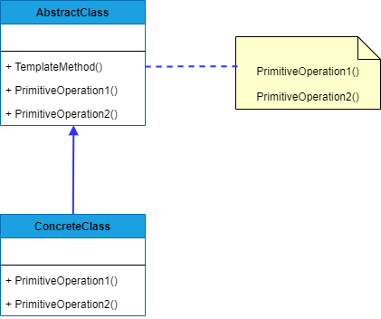

## TEMPLATE METHOD
##### tags: `Padrões de projetos` `Padrões comportamentais`

### Intenção
Define o esqueleto de um algoritmo em uma operação, adiando alguns passos para subclasses. Permite que subclasses redefinam determinadas etapas de um algoritmo sem alterar a estrutura do algoritmo.

### Descrição
Este padrão pode ser aplicado quando existe um algoritmo que resolve um problema a partir de uma série de operações (partes), chamadas da mesma forma, porem estas formas podem variar. Esta variação é então explicitada em subclasses, usando polimorfismo. Um método na classe base nesse caso funciona com um "template", que chama operações em pontos específicos do código, de forma apropriada. Subclasses então apenas se encarregam de dar uma forma concreta a estes pontos já chamados. É uma espécie de inversão de controle, pois nesse caso é a classe base que chama indiretamente métodos das classes filhas, e não o contrário.

### Benefícios
Um benefício de uso do padrão é evitar redundância de código, nesse caso, a chamada a vários métodos em sequência.

### Frequência de uso 
Nível 3

### Participantes
* AbstractClass - Define as operações primitivas abstratas que as subclasses concretas definem para implementar passos de um algoritmo; implementa um método-template que define o esqueleto de um algoritmo;

* ConcreteClass - Implementa as operações primitivas para executar os passos específicos invariantes do algoritmo;

### Diagrama


### Exemplo
```csharp
    class Program
    {
        static void Main(string[] args)
        {
            Correcao prova = new CorrecaoProva();
            prova.Processar();
            Correcao redacao = new CorrecaoRedacao();
            redacao.Processar();            
        }
    }

    public abstract class Correcao
    {
        public abstract void Corrigir();
        public abstract void VerificarPrerequisitos();
        public abstract void EnviarDadosParaBancoDeDados();
        public abstract void LimparCorrecoesAnteriores();
        public abstract void Iniciar();

        public void Processar(){
            Iniciar();
            VerificarPrerequisitos();
            LimparCorrecoesAnteriores();
            Corrigir();
            EnviarDadosParaBancoDeDados();
        }
    }

    public class CorrecaoProva : Correcao
    {
        private string _prova = "Prova";
        public override void Corrigir()
        {
            Console.WriteLine($"Corrigindo {_prova}");
        }

        public override void EnviarDadosParaBancoDeDados()
        {
            Console.WriteLine($"Enviando os dados da {_prova} para o banco de dados");
        }

        public override void Iniciar()
        {
            Console.WriteLine($"Iniciando a correção da {_prova}");
        }

        public override void LimparCorrecoesAnteriores()
        {
            Console.WriteLine($"Limpando correções da {_prova} anterior");
        }

        public override void VerificarPrerequisitos()
        {
            Console.WriteLine($"Verificando os pré-requisitos de correção da {_prova}");
        }
    }

    public class CorrecaoRedacao : Correcao
    {
        private string _redacao = "Redação";
        public override void Corrigir()
        {
            Console.WriteLine($"Corrigindo {_redacao}");
        }

        public override void EnviarDadosParaBancoDeDados()
        {
            Console.WriteLine($"Enviando os dados de {_redacao} para a base de dados");
        }

        public override void Iniciar()
        {
            Console.WriteLine($"Iniciando a correção da {_redacao}...");
        }

        public override void LimparCorrecoesAnteriores()
        {
            Console.WriteLine($"Limpando dados da {_redacao} anterior...");
        }

        public override void VerificarPrerequisitos()
        {
            Console.WriteLine($"Verificando os pré-requisitos de correção da {_redacao}");
        }
    }
```