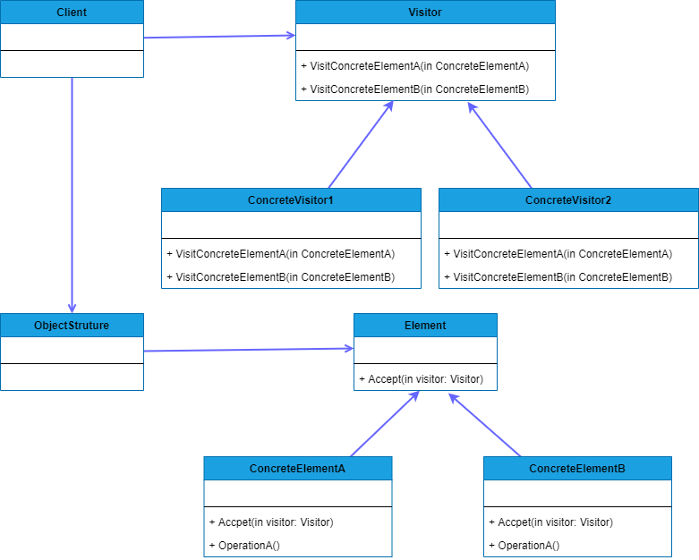

## VISITOR
##### tags: `Padrões de projetos` `Padrões comportamentais`

### Intenção
Este padrão tem por objetivo representar uma operação a ser executada nos elementos de uma estrutura de objetos. Visitor permite definir uma nova operação sem mudar as classes dos elementos sobre os quais opera (*Gamma et al., 1955*).

### Descrição
Este padrão pode ser aplicado quando é necessário executar operações em objetos concretos, porém esses objetos contêm uma estrutura com muitas classes com interfaces diferentes. Ou seja, no caso em que essas operações distintas necessitam ser executadas sem causar um acoplamento entre a classe cliente e elementos concretos. A solução proposta por este padrão consiste na criação de duas hierarquias de classes, uma para os elementos que recebem as operações e outra para os visitantes que definem as operações.

### Benefícios
Facilidade na adição de novas operações que dependem de objetos complexos.

### Frequência de uso 
Nível 1

### Participantes
* **Visitor** - Declara uma operação *Visit* para cada *ConcreteElement* na estrutura do objeto; o visitante pode acessar o elemento diretamente através da interface específica;
* **ConcreteVisitor** - Implementa cada operação (fragmento do algoritmo) declarada por *Visitor*;
* **Element** - Define a operação *Accept* que aceita o visitante;
* **ConcreteElemente** - Implementa a operação *Accept*;
* **ObjectStructure** - Pode enumerar seus elementos; pode fornecer uma interface para visitações; pode ser uma composição ou coleção;

### Diagrama


### Exemplo
```csharp
    class Program
    {
        static void Main(string[] args)
        {
            // Configurar a estrutura
            ObjectStructure obj = new ObjectStructure();
            obj.Attach(new ConcreteElementA());
            obj.Attach(new ConcreteElementB());

            // criar os visitors
            ConcreteVisitor1 v1 = new ConcreteVisitor1();
            ConcreteVisitor2 v2 = new ConcreteVisitor2();

            // estrutura aceitar visitors
            obj.Accept(v1);
            obj.Accept(v2);
        }
    }

    public abstract class Visitor
    {
        public abstract void VisitConcreteElementA(ConcreteElementA concreteElementA);
        public abstract void VisitConcreteElementB(ConcreteElementB concreteElementB);
    }

    public class ConcreteVisitor1: Visitor
    {
        public override void VisitConcreteElementA(ConcreteElementA concreteElementA)
        {
            Console.WriteLine($"{concreteElementA.GetType().Name} visitado por {this.GetType().Name}");
        }

        public override void VisitConcreteElementB(ConcreteElementB concreteElementB)
        {
            Console.WriteLine($"{concreteElementB.GetType().Name} visitado por {this.GetType().Name}");
        }
    }
    public class ConcreteVisitor2: Visitor
    {
        public override void VisitConcreteElementA(ConcreteElementA concreteElementA)
        {
            Console.WriteLine($"{concreteElementA.GetType().Name} visitado por {this.GetType().Name}");
        }

        public override void VisitConcreteElementB(ConcreteElementB concreteElementB)
        {
            Console.WriteLine($"{concreteElementB.GetType().Name} visitado por {this.GetType().Name}");
        }
    }   

    public abstract class Element
    {
        public abstract void Accept(Visitor visitor);
    } 

    public class ConcreteElementA: Element
    {
        public override void Accept(Visitor visitor)
        {
            visitor.VisitConcreteElementA(this);
        }

        public void OperationA()
        {

        }
    }
    public class ConcreteElementB: Element
    {
        public override void Accept(Visitor visitor)
        {
            visitor.VisitConcreteElementB(this);
        }

        public void OperationB()
        {

        }
    }    

    public class ObjectStructure
    {
        private List<Element> _elements = new List<Element>();
        public void Attach(Element element){
            _elements.Add(element);
        }

        public void DeAttach(Element element){
            _elements.Remove(element);
        }

        public void Accept(Visitor visitor){
            foreach (var element in _elements)
            {
                element.Accept(visitor);
            }
        }
    }  
```